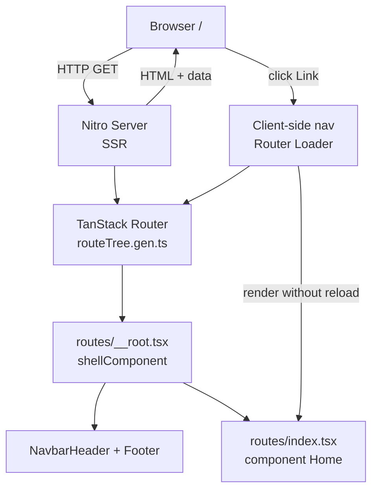

# Architecture & Folder Structure — BEM FILKOM UNIDA

This document is the reference for the whole team. Read it before adding files.

---

## 1. Overview

The BEM FILKOM UNIDA website runs on **TanStack Start** — a **full-stack React** framework (SSR plus
client-side navigation in a single project, not a plain SPA). Page content (navbar, footer, page body)
is rendered on the server first and then hydrated in the browser, so it loads fast and is search-engine
friendly.

All application code lives in the **project root** (there is no `src/` directory).

---

## 2. Tech Stack

| Layer | Technology | Version | Role |
| --- | --- | --- | --- |
| Runtime & package manager | [Bun](https://bun.sh) | 1.3 | Runs the dev server, builds, installs dependencies |
| Framework | [TanStack Start](https://tanstack.com/start) | 1.168 | SSR, routing, server functions, Nitro server |
| UI | [React](https://react.dev) | 19.2 | UI components |
| Routing | [TanStack Router](https://tanstack.com/router) | 1.170 | File-based routing, type-safe `Link` |
| Styling | [Tailwind CSS](https://tailwindcss.com) | 4.1 | Utility-first CSS, no per-component CSS files |
| Bundler | [Vite](https://vite.dev) | 8 | Dev server and build |
| Language | [TypeScript](https://typescriptlang.org) | 6.0 | Strict mode, everything typed |
| Deployment | [Cloudflare Workers](https://workers.cloudflare.com) via [Wrangler](https://developers.cloudflare.com/workers/wrangler/) 4.147 | Build output deployed as a Worker (`wrangler.jsonc`) |

Code style: **TypeScript strict**, no semicolons at end of line, 2-space indent (TanStack scaffold defaults).

---

## 3. Folder Structure

```
.
├── routes/                    # EVERY page is a route
│   ├── __root.tsx             # Global layout: <head>, NavbarHeader, <main>, Footer
│   ├── index.tsx              # /          Home
│   ├── about.tsx              # /about     About
│   ├── division.tsx           # /division  Division
│   └── contact.tsx            # /contact   Contact
│
├── components/                # Reusable React components
│   ├── layout/                # Frame components: navbar, footer, sidebar
│   │   ├── NavbarHeader.tsx   # <NavbarHeader /> + <NavLinks /> (also used by Footer)
│   │   └── Footer.tsx         # <Footer />
│   ├── ui/                    # Generic components: Button, Card, Input, Badge
│   └── sections/              # Page sections, one folder per page
│       ├── home/              # Sections for routes/index.tsx
│       │   └── Hero.tsx
│       ├── about/             # Sections for routes/about.tsx
│       │   └── Intro.tsx
│       ├── division/          # Sections for routes/division.tsx
│       │   └── Intro.tsx
│       └── contact/           # Sections for routes/contact.tsx
│           └── Intro.tsx
│
├── data/                      # Content and static data (kept out of components)
│   └── nav.ts                 # NavItem type + navbar link list
│
├── hooks/                     # Custom React hooks shared across pages
├── lib/                       # Pure utility functions (date formatting, slugs, etc.)
├── public/                    # Static assets (images, favicon, robots.txt)
│
├── router.tsx                 # Router setup and createRouter types
├── routeTree.gen.ts           # GENERATED — never edit by hand
├── styles.css                 # Tailwind import + global styles
├── vite.config.ts             # Plugins: TanStack Start, Tailwind, Nitro
├── tsr.config.json            # File-based router config
├── tsconfig.json              # TypeScript + path aliases
└── package.json               # Scripts and dependencies
```

### Where does code go?

| Folder | Holds | Do not put here |
| --- | --- | --- |
| `routes/` | One file per page, containing **only** composition: `<Hero />`, `<About />` | Long logic/JS, hardcoded data |
| `components/layout/` | Components that wrap the whole site | Page content |
| `components/ui/` | Generic components with no BEM context (button, card, input) | Page-specific copy |
| `components/sections/` | Page sections, filed under a folder named after the page (`sections/about/` → `/about`) | Sections used by more than one page — those go straight in `components/` |
| `data/` | Copy, division list, contacts, member names | Objects used by a single component |
| `lib/` | Pure functions without React (`slugify`, `formatDate`) | Hooks (those go in `hooks/`) |
| `public/` | Images, logo, `.txt` files | JS/TS modules |

> **Rule:** if a component or data set is reused by other pages → extract it into `components/` or `data/`.
> Used by one page only → it goes in that page's folder under `components/sections/<page>/`.

### One folder per page (team split)

Each page owns a folder so several people can build pages at the same time without touching the same files:

```
components/sections/about/Intro.tsx      ← one person's work
components/sections/about/Vision.tsx
components/sections/about/Structure.tsx
```

The route file stays pure composition and never grows past a list of section imports:

```tsx
// routes/about.tsx
import { Intro } from '../components/sections/about/Intro'
import { Structure } from '../components/sections/about/Structure'
import { Vision } from '../components/sections/about/Vision'

function About() {
  return (
    <>
      <Intro />
      <Vision />
      <Structure />
    </>
  )
}
```

Consequences:
- Adding a section = new file in `routes/`'s page folder + one import line in the route file. Merge conflicts on a
  page are then limited to the route file's import block.
- Rename the page folder only if you also rename the route file — folder name always matches the page's URL segment.
- A section two pages both need does not belong in a page folder; move it up into `components/ui/` or
  `components/layout/`.

---

## 4. Runtime Architecture



1. A request hits the **Nitro server** (Nitro is also what serves the dev server on `bun run dev`).
2. The router picks a route file from `routeTree.gen.ts` (generated by `tsr generate`).
3. `routes/__root.tsx` (`shellComponent`) renders the HTML frame: `<head>`, navbar, `<main>{children}</main>`, footer.
4. The page component renders inside `<main>`.
5. Once the page is live, navigation through `<Link>` happens **in the browser** — no full reload, only the
   route payload is fetched (`defaultPreload: 'intent'` in `router.tsx` = fetch while the pointer hovers a link).

Practical consequences:
- Pages without server data can stay stateless; when you need live data (e.g. events from an API or DB),
  use a **server function** (`createServerFn`) in the route file or in `data/` — the component itself stays unchanged.
- The layout is never repeated per page — change `__root.tsx` once and every page follows.

---

## 5. Routing

Files in `routes/` become URLs automatically:

| File | URL |
| --- | --- |
| `routes/index.tsx` | `/` |
| `routes/about.tsx` | `/about` |
| `routes/division.tsx` | `/division` |
| `routes/contact.tsx` | `/contact` |
| `routes/division/programming.tsx` | `/division/programming` |

Static segments (no `$`) win over dynamic ones (`$slug`). Always navigate with the `Link` component, **never**
`<a href>` — a plain anchor forces a full reload and kills client-side navigation.

### Adding a new page

```bash
# 1. create the route file and its section folder, e.g. /program
touch routes/program.tsx
mkdir -p components/sections/program
```

```tsx
// routes/program.tsx
import { createFileRoute } from '@tanstack/react-router'
import { Intro } from '../components/sections/program/Intro'

export const Route = createFileRoute('/program')({
  component: Program,
})

function Program() {
  return <Intro />
}
```

Then add the link to `data/nav.ts` (`{ to: '/program', label: 'Program' }`) — navbar **and** footer update
together because both read from that single source. `routeTree.gen.ts` is regenerated automatically by the
dev server / `bun run generate-routes`.

---

## 6. Critical Configuration (don't change without understanding)

Running without a `src/` directory needs the three settings below. Reverting any one of them breaks the build
with `Could not resolve entry for router entry: router in .../src`.

| File | Setting | Why |
| --- | --- | --- |
| `vite.config.ts` | `tanstackStart({ srcDirectory: '.' })` | Tells Start that entries and routes live in the root, not `src/` |
| `tsr.config.json` | `routesDirectory: "./routes"`, `generatedRouteTree: "./routeTree.gen.ts"` | Tells `tsr generate` where the route tree goes |
| `tsconfig.json` + `package.json` | `"#/*": ["./*"]` (and `@/*`) | Import alias: `import { nav } from '#/data/nav'` |

`routeTree.gen.ts` is generated output. **Never edit or commit it manually** — manual edits are lost whenever
routes change.

---

## 7. Commands (package.json)

```bash
bun install              # install dependencies
bun run dev              # dev server + HMR → http://localhost:3000
bun run build            # production build → .output/ (Cloudflare Worker + assets)
bun run preview          # run the built worker locally (wrangler dev)
bun run deploy           # deploy to Cloudflare Workers
bun test                 # unit tests (Bun's built-in runner)
bun run generate-routes  # regenerate routeTree.gen.ts manually

bunx tsc --noEmit        # type check (run before pushing)
```

CI runs `bunx tsc --noEmit`, `bun test`, and `bun run build` on every push and pull request to `develop`.
Only a push to `main` deploys to Cloudflare, and the site is under development on `develop` — so the live
production site stays on `main` until the team merges on purpose. See the branch model in `README.md`.

### Testing

- Runner: **`bun test`** — Bun's built-in runner, no test framework installed. `import { test, expect } from 'bun:test'`.
- Tests sit next to the code they cover: `data/nav.test.ts` covers `data/nav.ts`. Same folder, same basename, `.test.ts`.
- Test **behaviour, not markup**: assert on data, pure functions, and invariants (a nav link must point at a
  route file that exists). Snapshotting JSX is discouraged — it breaks on every copy tweak.
- CI runs `bun test` and fails the build on red. Run it locally before pushing.

```ts
// data/nav.test.ts
import { describe, expect, test } from 'bun:test'
import { nav } from './nav'

describe('nav', () => {
  test('targets are unique', () => {
    expect(new Set(nav.map((link) => link.to)).size).toBe(nav.length)
  })
})
```

- No linter and no component-rendering tests yet. Add `@happy-dom/global-registrator` only when the first real
  component test is written — plain `bun test` covers pure logic and data without it.

---

## 8. Good to Know

- **TanStack Devtools** (bottom-right corner) only appears in `bun run dev`. No need to guard it with
  `if (import.meta.env.DEV)` — it is handled automatically.
- **The build target is Cloudflare Workers**, set in `vite.config.ts` via the Nitro preset `cloudflare_module`.
  Worker name, account id, and compatibility date come from `wrangler.jsonc`; Nitro merges them into the deploy
  config it writes to `.output/server/wrangler.json`. Change the preset only if you also move off Cloudflare —
  `.output/` is not a Node server and cannot be started with `node`.
- **Static assets need an `ASSETS` binding.** Nitro wires it automatically; if a CSS/JS/image 404s in the
  deployed worker, the assets directory in the generated wrangler config is the thing to check.
- **Server and client share one bundle.** Code that runs on the server (server functions, `process.env` access)
  must never reach the browser. Never put secrets or `.env` values directly in a component — go through a
  server function.
- `styles.css` only holds the Tailwind import plus a reset. Component styles are utility classes in JSX
  (`className="text-4xl font-bold"`), not separate CSS files. When you need a custom class, use `@apply`
  inside `styles.css` or `@layer components`.
- `.output/`, `.tanstack/`, and `node_modules/` are already in `.gitignore`.
- **Navbar links wrap instead of collapsing into a JS hamburger menu.** That is deliberate — no client state.
  If the menu grows past roughly six items, swap `NavLinks` for a native `<details>` disclosure (still no JS).
- Codebase convention: **no comments in source files.** Explain intent in `docs/ARCHITECTURE.md` or in the PR
  description instead.
